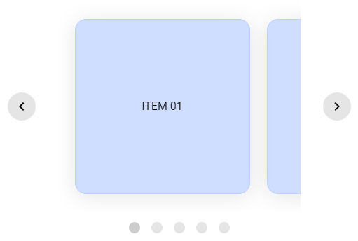

# carousel-study

## Contexto

Este projeto trata-se de um estudo com carrossel, com a proposta de criar um carrossel apenas com HTML, CSS e React (sem bibliotecas que criem carrosséis ou bibliotecas de animações)

O desafio foi montar um carrossel para desktop que transladasse clicando nos elementos (cards), e que possuísse navegação a partir das setas e a partir das dots

## Tecnologias usadas

Front-end:

Desenvolvido usando: HTML5, Styled Components, React, Typescript

## Instalando dependências

Front-end:

yarn install

## Executando aplicação

Para rodar o Front-end:

yarn dev
